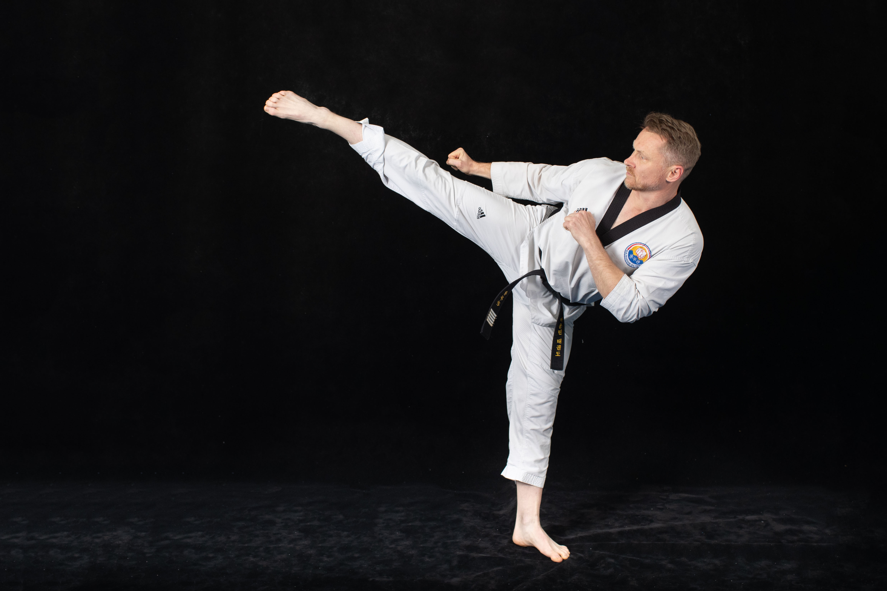

A martial arts school based in Blaxland, NSW, Australia, dedicated to teaching traditional Taekwondo while incorporating modern training methods.

## About

Founded in 2013 on the principles of discipline, perseverance, and self-improvement, Blue Mountains Taekwondo provides high-quality martial arts instruction for all ages and experience levels.

## Programs

- **Little Tigers** (ages 4-7)
- **Junior Taekwondo** (ages 7-13)
- **Senior Taekwondo** (ages 13+)
- **Combat Taekwondo** (sport sparring & competition training)
- **Fighting Fit** (martial arts-inspired fitness)

Whether students are looking to develop confidence, improve fitness, or compete at a high level, Blue Mountains Taekwondo offers a supportive, challenging, and engaging environment to help them reach their goals.

## Training Techniques

Training at Blue Mountains Taekwondo includes a balance of traditional techniques, practical self-defense applications, and sport-focused training. Students learn essential Taekwondo techniques including:

- **Dollyo Chagi** (Roundhouse Kick) - A powerful circular kick targeting the opponent's mid-section
- **Ap Chagi** (Front Kick) - A direct, straight-line kick for stopping advancing opponents
- **Yop Chagi** (Side Kick) - A devastating kick using the edge of the foot as the striking surface
- **Poomsae** (Forms) - Pre-arranged patterns of movements for developing proper technique and focus

## Visit

Website: [bluemountainstaekwondo.com](https://bluemountainstaekwondo.com)