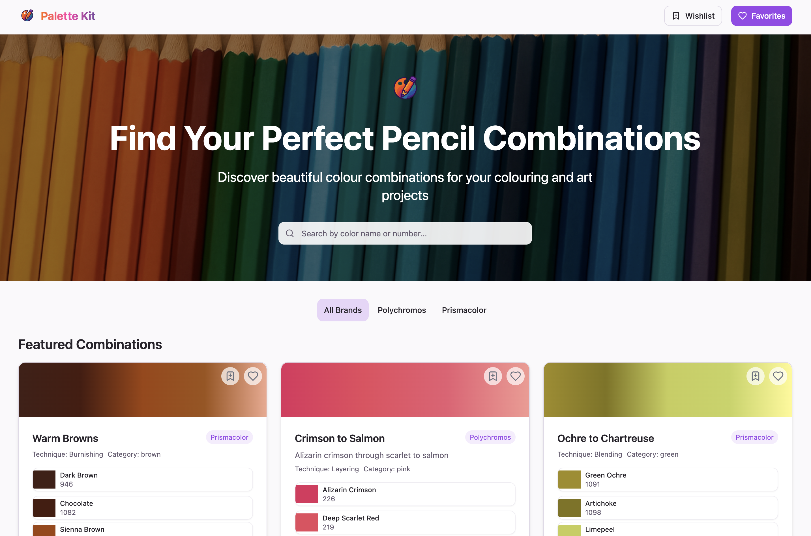
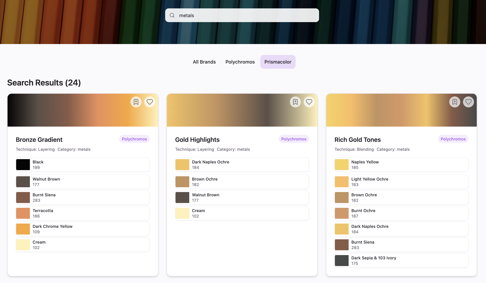
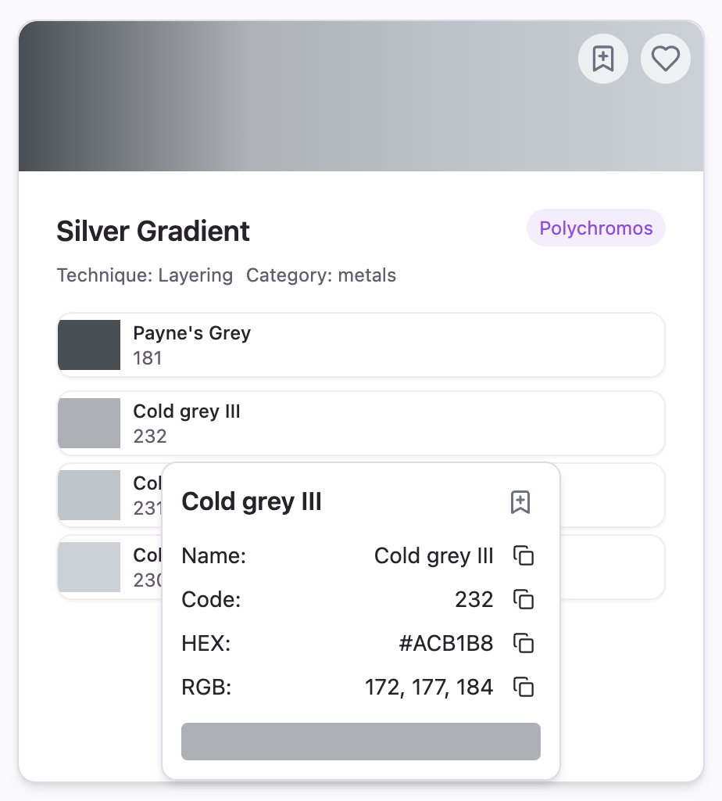
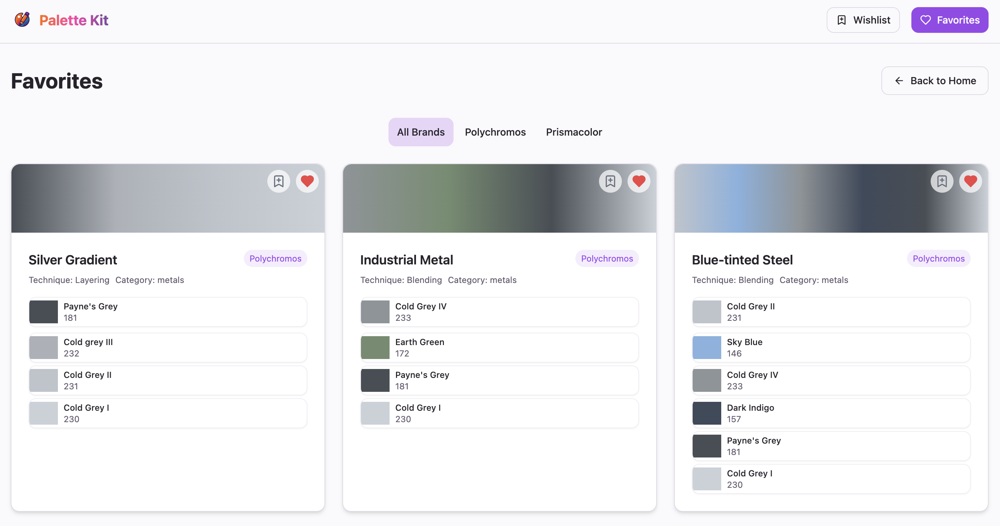

Palette Kit is a digital tool designed to simplify the colour selection process for artists who work with coloured pencils. Born from a collaboration with [My Colourful Country Life](https://www.mycolourfulcountrylife.com/), this project addresses a common challenge faced by coloured pencil artists: finding the perfect colour combinations to achieve desired effects.

## About

Palette Kit was created to help artists navigate the overwhelming world of coloured pencil selection. With countless brands and colour options available, finding the right combinations for blending, layering, and creating depth can be time-consuming and frustrating. Palette Kit streamlines this process, allowing artists to focus more on creating and less on searching for the right colours.

## Current Features

- **Colour Combination Database**: Access a growing library of proven colour combinations that work well together
- **Favourites**: Save your preferred colour combinations for quick access
- **Wishlist**: Track coloured pencils you want to add to your collection

### Search by Colour Family

### Colour Details

### Favourites

## Future Features

- **Account Creation**: Personal profiles for saving your combinations and preferences
- **Community Sharing**: Discover combinations shared by other artists and contribute your own discoveries
- **Visual Reference**: See examples of colour combinations in use
- **Brand Cross-Reference**: Find equivalent colours across different coloured pencil brands
- **Palette Creation**: Create and organise custom palettes for specific projects

## Background

The inspiration for Palette Kit came from observing the meticulous process that coloured pencil artists go through to find the perfect colour combinations. Many artists, including Karen Stivala of My Colourful Country Life, spend considerable time experimenting with different pencil combinations to achieve specific effects in their artwork.

By digitalising this knowledge and creating a platform for sharing it, Palette Kit aims to make the artistic process more efficient while still maintaining the creative exploration that makes coloured pencil art so rewarding.

## Visit

Website: [palettekit.com](https://palettekit.com)